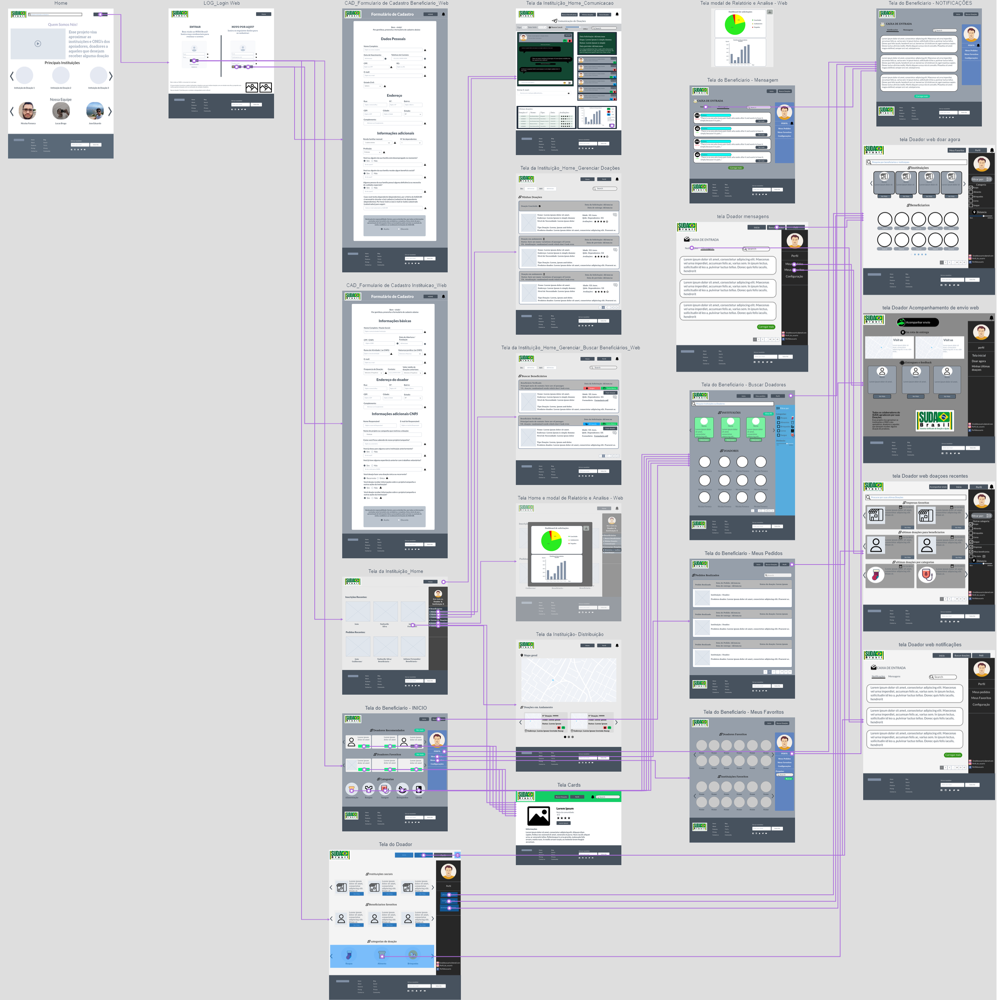

# Projeto de Interface

Ao discutir, o grupo entrou em consenso sobre definir três telas principais para atender a proposta inicial da aplicação: A tela de beneficiário, a tela de doador e de instituição. Cada uma dessas telas principais terão subtelas que correspondem a determinadas funções propostas para uma interação completa do sistema com o usuario. 

Propomos que o usuario inicialmente deve conhecer a aplicação, compreendendo sua função e quais foram as motivação para sua criação. Após isso propomos que o usuario tenha uma área dentro do sistema onde possa ser conectado com as instituições, doadores ou os beneficiarios, dependendo de sua necessidade.
Para cada tipo de usuario definimos funções básicas para pleno funcionamento do sistema e uso do usuario.

Utilizamos do User Flow e dos Wireframes para expressar visualmente o comportamento da aplicação para o usuario.

## User Flow

Esse fluxo mostra como será o caminho do usuario ao utilizar a aplicação Web, desde entrar na pagina inicial da aplicação até acessar a área do respectivo usuario e utilizar suas funções. 

## Wireframes

Para projetarmos a estrutura basica da nossa aplicação web, utilizamos inicialmente a ferramenta Marvel App, devido a sua facilidade de utilização.

Link para os Wireframes da Aplicação Web: https://marvelapp.com/prototype/9g4h3b5
